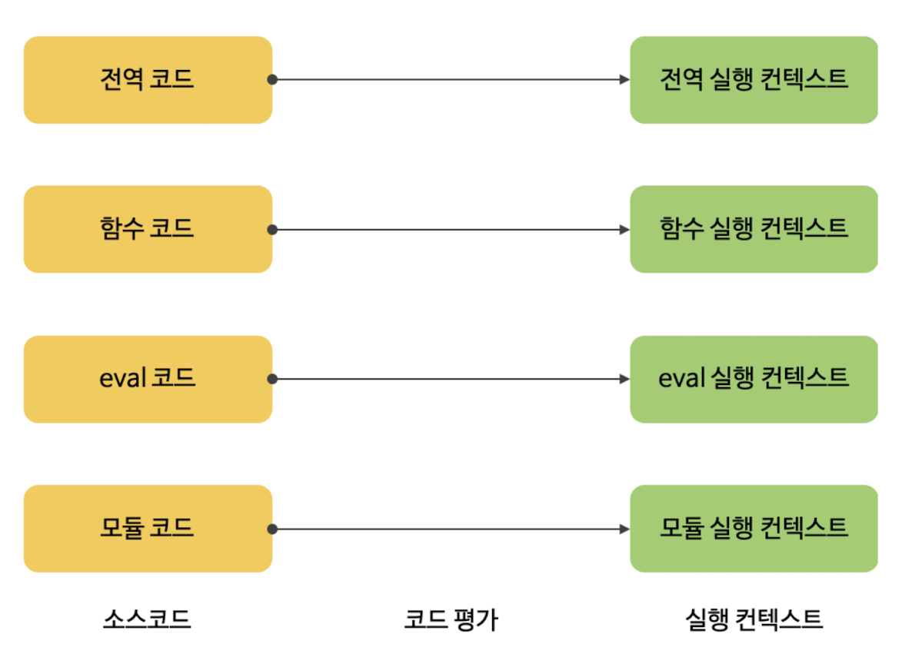
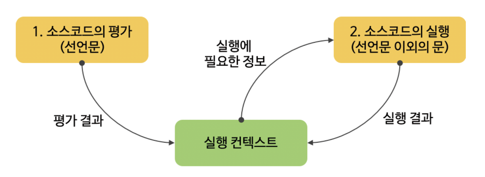

# 23장 실행 컨텍스트

## 23.1 소스코드의 삽입

- ECMAScript 사양은 소스코드를 4가지 타입으로 구분한다. 4가지 타입의 소스코드는 실행 컨텍스트를 생성한다.

1. `전역 코드` : 전역에 존재하는 소스코드.
2. `함수 코드` : 함수 내부에 존재하는 소스코드. (함수 내부에 중첩된 함수, 클래스 등의 내부코드는 포함되지 않는다.) 3.` eval 코드` : eval 함수에 인수로 전달되어 실행되는 소스코드.
3. `모듈 코드` : 모듈 내부에 존재하는 소스코드.

- 4가지 소스코드의 타입에 따라 실행 컨텍스트를 생성하는 과정과 관리 내용이 다르다.

  

<br />

## 23.2 소스코드의 평가와 실행

- 자바스크립트 엔진은 소스코드를 2개의 과정, 즉 `소스코드의 평가`와 `소스코드의 실행` 과정으로 나누어 처리한다.
- 소스코드 평가 과정
  - 실행컨텍스트 생성
  - 변수, 함수 등의 선언문만 먼저 실행
  - 생성된 변수나 함수 식별자를 키로 실행컨텍스트가 관리하는 스코프에 등록
- 소스코드 실행 과정 (런타임)

  - 소스코드에 필요한 정보(변수, 함수)의 참조를 실행 컨텍스트가 관리하는 스코프에서 검색해서 취득한다.
  - 변수 값의 변경 등 소스코드의 실행 결과는 다시 실행 컨텍스트가 관리하는 스코프에 등록된다.

  

<br />

## 23.3 실행 컨텍스트의 역할

```
// 1. 전역 코드 평가
// 2. 전역 코드 실행
const x = 1;
const y = 2;

// 3. 함수 코드 평가
function foo(a) {
  // 4. 함수 코드 실행
  const x = 10;
  const y = 20;

  console.log(a + x + y); // 130
}

// 함수 호출
foo(100);

// 메서드 호출
console.log(x + y); // 3
```

1. 전역 코드 평가

   - `선언문만 먼저 실행`한다.
   - 전역코드의 변수 선언문과 함수 선언문이 먼저 실행되고, 그 결과 생성된 전역 변수와 전역 함수가 실행컨텍스트가 관리하는 `전역 스코프에 등록`된다.

2. 전역 코드 실행

   - 코드가 순차적으로 실행된다.
   - 이때 전역 변수에 `값이 할당되고 함수가 호출`된다.
   - 함수가 호출되면 순차적으로 실행되던 전역 코드의 실행을 일시 중단하고 코드 실행순서를 변경하여 함수 내부로 진입한다.

3. 함수 코드 평가

   - 매개변수와 지역변수 선언문이 먼저 실행되고, 그 결과 생성된 매개변수와 지역변수가 실행컨텍스트가 관리하는 지역 `스코프에 등록`된다.
   - 함수 내부에서 지역변수처럼 사용할 수 있는 `arguments` 객체가 생성되어 지역 스코프에 등록되고 `this 바인딩`도 결정된다.

4. 함수 코드 실행
   - `매개변수와 지역변수에 값이 할당`되고 console.log 메서드가 호출된다.
   - 함수 코드 실행 과정이 종료되면 함수 호출 이전으로 되돌아가 전역 코드 실행을 계속한다.

- 이처럼 코드가 실행되려면 스코프, 식별자, 코드 실행 순서 등의 관리가 필요하다.
- 이 모든 것을 관리하는 것이 바로 `실행 컨텍스트` 다.
- `실행 컨텍스트`
  - 식별자(변수, 함수, 클래스 등의 이름)를 등록하고 관리하는 스코프와 코드 실행순서 관리는 구현한 내부 매커니즘으로, 모든 코드는 실행 컨텍스트를 통해 실행되고 관리된다.
  - <u>식별자와 스코프</u>는 실행컨텍스트의` 렉시컬 환경`으로 관리하고, <u>코드 실행 순서</u>는 `실행 컨텍스트 스택`으로 관리한다.

<br />

## 23.4 실행 컨텍스트 스택

```
const x = 1;

function foo() {
  const y = 2;

  function bar() {
  	const z = 3;
    console.log(x + y + z);
  }

  bar();
}

foo(); // 6
```

- 위 코드를 실행하면 코드가 실행되는 시간의 흐름에 따라 실행 컨텍스트 스택에는 다음과 같이 실행 컨텍스트가 추가되고 제거된다.
  

1. `전역 코드의 평가와 실행`

   - 먼저 전역 코드를 평가하여 전역 실행 컨텍스트를 생성하고, 실행 컨텍스트 스택에 푸시한다.

2. `foo 함수 코드의 평가와 실행`

   - 전역 함수 foo가 호출되면 코드의 제어권이 foo 함수 내부로 이동한다.
   - foo 함수 내부의 함수 코드를 평가하여 foo 함수 실행 컨텍스트를 생성하고 실행 컨텍스트 스택에 푸시한다.

3. `bar 함수 코드의 평가와 실행`

   - 전역 함수 bar가 호출되면 코드의 제어권이 bar 함수 내부로 이동한다.
   - bar 함수 내부의 함수 코드를 평가하여 bar 함수 실행 컨텍스트를 생성하고 실행 컨텍스트 스택에 푸시한다.

4. `foo 함수 코드로 복귀`

   - bar함수가 종료되면 코드의 제어권은 다시 foo함수로 이동한다.
   - 이때 자바스크립트 엔진은 bar함수 실행 컨텍스트를 실행 컨텍스트 스택에서 팝하여 제거한다.

5. `전역 코드로 복귀`
   - foo 함수가 종료되면 코드의 제어권은 다시 전역 코드로 이동한다.
   - 이때 자바스크립트 엔진은 foo함수 실행 컨텍스트를 실행 컨텍스트 스택에서 팝하여 제거한다.
   - 그리고 더 이상 실행할 전역 코드가 남아있지 않으므로 전역 실행 컨텍스트도 실행 컨텍스트 스택에서 팝되어 실행 컨텍스트 스택에는 아무것도 남아있지 않게 된다.

<br />

## 23.5 렉시컬 환경

- 렉시컬 환경은 식별자와 식별자에 바인딩된 값, 그리고 상위 스코프에 대한 참조를 기록하는 자료구조로 실행 컨텍스트를 구성하는 컴포넌트다.
- 즉, `스코프와 식별자를 관리`한다.
- 렉시컬 환경은 다음과 같이 두 개의 컴포넌트로 구성된다.
  1. `환경 레코드` (Environment Record)  
     스코프에 포함된 식별자를 등록하고, 등록된 식별자에 바인딩된 값을 관리하는 저장소다.
  2. `외부 렉시컬 환경에 대한 참조` (Outer Lexical Environment Reference)  
     상위 스코프를 가리킨다.
