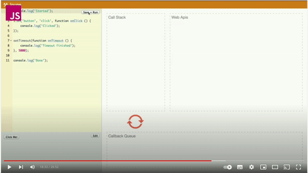
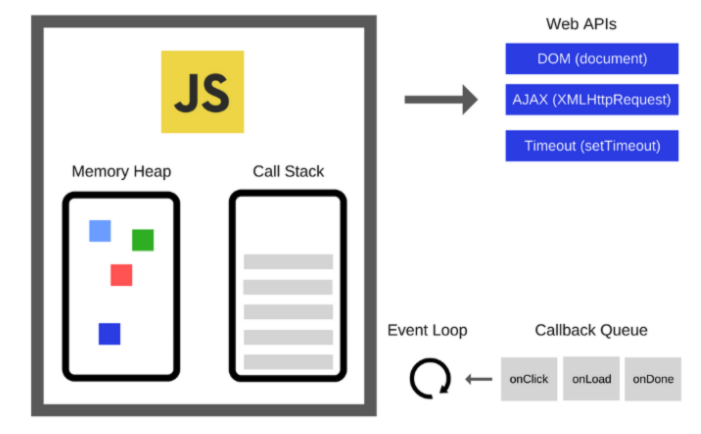

## 동기처리와 비동기처리

**자바스크립트 엔진은 단 하나의 실행 컨텍스트를 갖는다.**

이는 함수를 실행 할 수 있는 수단이 단 하나이며, 동시에 2개 이상의 함수를 처리할 수 없다는 것을 의미한다.

실행중인 컨텍스트를 제외한 모든 실행 컨텍스트들은 모두 실행 대기중인 태스크 들이다.

대기하다가 현재 실행중인 함수가 종료되어 현재 실행 컨텍스트가 제거되면 실행된다.

이처럼 자바스크립트 엔진은 한 번에 하나의 태스크만 처리할 수 있는 `싱글 스레드` 방식으로 동작한다.

싱글 스레드 방식은 처리에 시간이 걸리는 태스크를 실행하는 경우 `블로킹(작업중단)` 이 발생한다.

그렇게 현재 실행중인 태스크가 종료할 때까지 다음에 실행될 태스크가 대기하는 방식을 `동기 처리` 라고 한다.

> 동기 처리 방식은 태스크를 하나씩 처리하므로 실행 순서가 보장된다는 장점이 있지만 앞선 태스크가 종료될 때까지 이후 태스크들이 블로킹 되는 단점이 있다.

실행중인 태스크가 종료되지 않은 상태라 해도 다음 태스크를 곧바로 실행하는 방식을 `비동기 처리` 라고 한다.

> 비동기 처리 방식은 현재 실행중인 태스크가 종료되지 않았더라도 다음 태스크를 곧바로 실행하므로 블로킹이 발생하지 않는 장점이 있지만 태스크의 실행 순서가 보장되지 않는 단점이 있다.

비동기 처리를 수행하는 비동기 함수는 전통적으로 콜백 패턴을 사용한다. 비동기 처리를 위한 콜백 패턴은 콜백 헬을 발생시켜 가독성을 헤치고, 비동기 처리 중 발생한 에러의 예외 처리가 어려우며 여러 개의 비동기 처리를 한 번에 처리하는 데도 한계가 있다. 이에 대해서는 promise에서 자세히 살펴본다.

타이머 함수와 http요청, 이벤트 핸들러는 비동기 처리 방식으로 동작한다.

## 이벤트 루프와 태스크 큐

자바스크립트는 싱글 스레드로 동작하지만 브라우저가 동작하는 것을 살펴보면 많은 태스크가 동시에 처리되는 것 처럼 느껴진다.

예를 들어, HTML요소가 애니메이션 효과를 통해 움직이면서 이벤트를 처리하기도 하고, HTTP 요청을 통해 서버로부터 데이터를 가지고 오면서 렌더링 하기도 한다.

이처럼 자바스크립트의 동시성을 지원하는 것이 바로 **이벤트 루프**다.

이벤트 루프는 브라우저에 내장되어 있는 기능 중 하나다.

브라우저 환경을 그림으로 표현하면 이와 같다고 한다.

### 콜 스택

23장 실행 컨텍스트에서 살펴본 것과 같이 소스코드 평가 과정에서 생성된 실행 컨텍스트가 추가되고 제거되는

스택 자료구조인 실행 컨텍스트 스택이 바로 **콜 스택**이다.

함수를 실행하면 함수 실행 컨텍스트가 순차적으로 콜 스택에 푸시되어 순차적으로 실행된다.

자바스크립트는 하나의 콜 스택을 사용하기 때문에 최상위 실행 컨텍스트(현재 실행중인 컨텍스트)가 종료되어

콜 스택에서 제거되기 전까지는 다른 어떤 태스크도 실행되지 않는다.

### 힙

**힙은 객체가 저장되는 메모리 공간이다**.

콜 스택의 요소인 실행 컨텍스트는 힙에 저장된 객체를 참조한다.

메모리에 값을 저장하려면 먼저 값을 저장할 메모리 공간의 크기를 결정해야 한다.

객체는 원시 값과는 달리 크기가 정해져 있지 않기 때문에 할당해야 할 메모리 공간의 크기를 런타임에 결정(동적 할당)해야 한다.

따라서 객체가 저장되는 메모리 공간인 힙은 위 사진처럼 구조화 되어 있지 않다는 특징이 있다.

이처럼 자바스크립트 엔진은 단순히 태스크가 요청되면 콜 스택을 통해 요청된 작업을 순차적으로 실행할 뿐이다.

비동기 처리에서 소스코드의 평가와 실행을 제외한 모든 처리는 자바스크립트 엔진을 구동하는 환경인 브라우저 또는 Node.js가 담당한다.

예로 `setTimeout` 함수의 평가와 실행은 자바스크립트 엔진이 담당하지만 호출 스케줄링을 위한 타이머 설정과 콜백 함수의 등록은 브라우저 또는 Node.js 가 담당한다.

이를 위해 브라우저 환경은 이벤트 루프와 태스크 큐를 제공한다.

### 태스크 큐

`setTimeout,setInterval` 같은 비동기 함수의 콜백 함수 또는 이벤트 핸들러가 일시적으로 보관되는 영역이다.

태스크 큐와는 별도로 프로미스의 후속 처리 메서드의 콜백 함수가 일시적으로 보관되는 마이크로태스크 큐도 존재한다.

### 이벤트 루프

이벤트 루프는 콜 스택에 현재 실행중인 실행 컨텍스트가 있는지, 그리고 태스크 큐에 대기 중인 함수(가 있는지 반복해서 확인한다. 만약 콜 스택이 비어있고 태스크 큐에 대기 중인 함수가 있다면 이벤트 루프는 순차적으로 (선입선출) 태스크 큐에 대기 중인 함수를 콜 스택으로 이동시킨다.

이 때 콜 스택으로 이동 된 함수는 실행된다. 즉, 태스크 큐에 일시 보관된 함수들은 비동기 처리 방식으로 동작한다

브라우저는 자바스크립트 엔진 외에도 렌더링 엔진과 web API를 제공한다.
